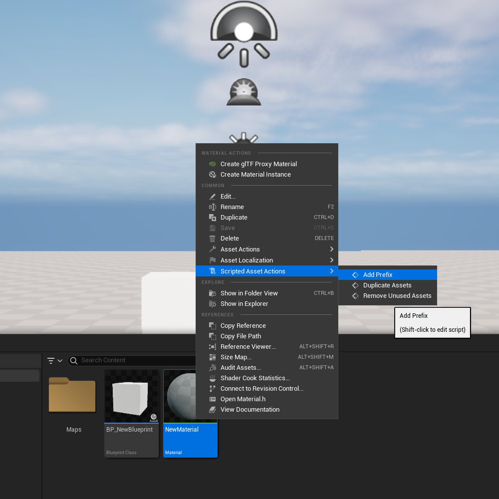

# 🧰 UTools – Asset Management Plugin for Unreal Engine

**UTools** is a powerful and user-friendly plugin built to streamline asset management in **Unreal Engine 5**. Whether you're working solo or in a team, UTools offers quick solutions for repetitive tasks, helping you stay productive and keep your project organized.

---

## 🚀 Key Features

- 🔤 **Add Recommended Prefixes**  
  Automatically prepend standardized prefixes to asset names based on their type (e.g., `SM_`, `T_`, `BP_`), improving project readability and consistency.

- 🧱 **Batch Asset Duplication**  
  Duplicate multiple assets simultaneously with a single click—perfect for prototyping or setting up variations.

- 🧹 **Delete Unused Assets**  
  Detect and remove unreferenced or unused assets to keep your project clean, lightweight, and optimized.

---

## ✅ Compatibility

- ✔️ Unreal Engine **5.3**
- ✔️ Unreal Engine **5.4**
- ✔️ Unreal Engine **5.5**

> UTools is built using native editor utility.

---

## 📦 Installation

1. **Download** and extract the `UTools.zip` file.
2. Navigate to your Unreal Engine project folder.
3. If it doesn't exist, **create a `Plugins` folder** in the root directory of your project.
4. **Copy the extracted `UTools` folder** into the `Plugins` directory.
5. Launch (or restart) your Unreal Engine project.
6. If prompted to recompile modules, click **Yes**.

> ℹ️ UTools will now be available from the Editor under the "Plugins" tab.

---

## 🎥 Demonstration

📺 [Watch the plugin in action on YouTube](https://www.youtube.com/watch?v=kdtswH21J70)

---

## ❤️ Support This Project

If you find this plugin useful and want to support further development, you can do so through our [**Patreon**](https://www.patreon.com/itandfeel). Every contribution helps us continue building tools that empower the Unreal Engine community.

---

---
